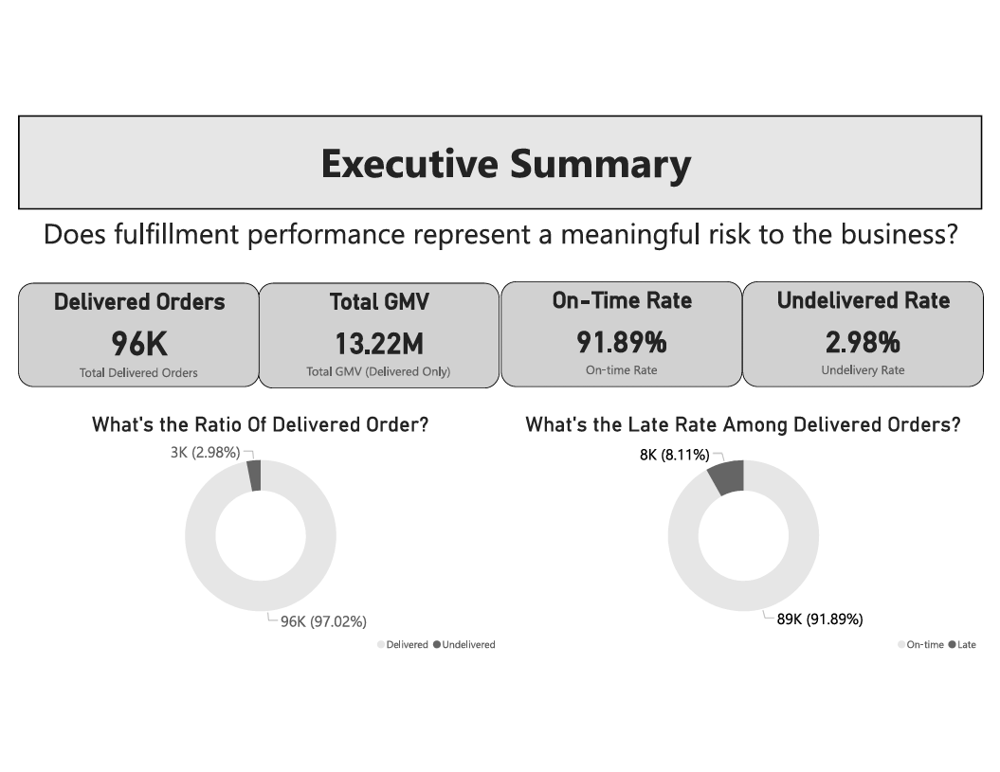
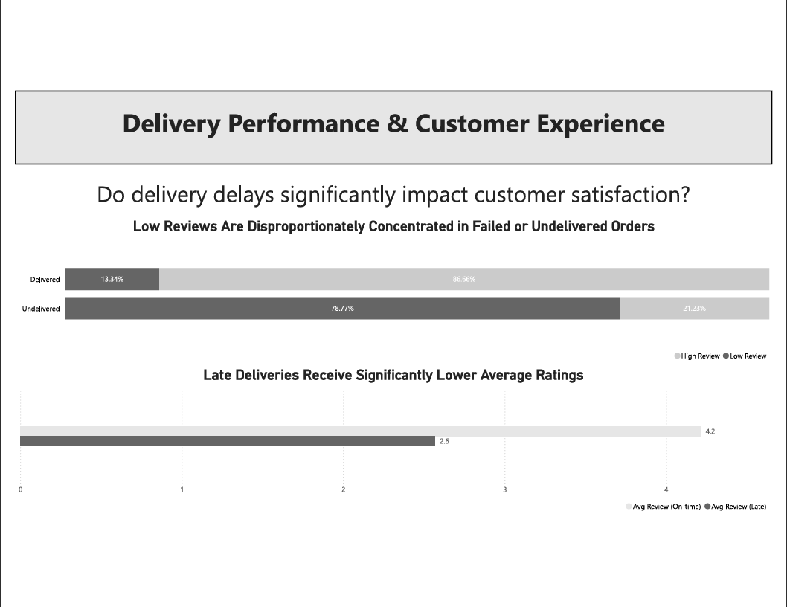
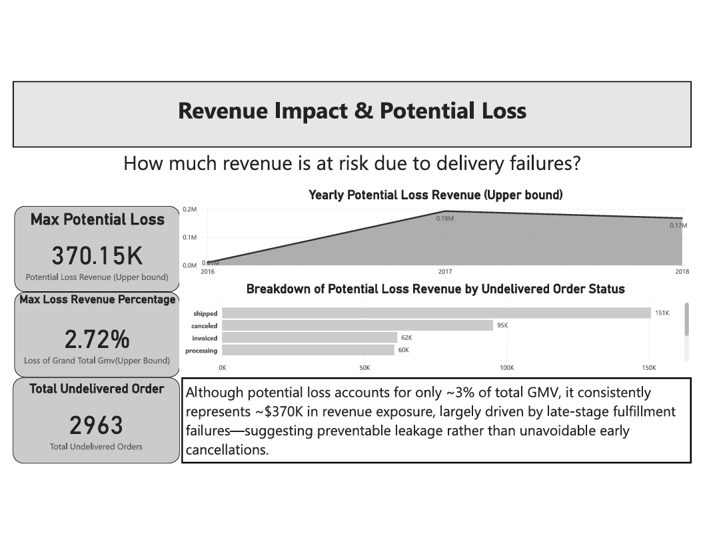

# Olist E-Commerce Data Analysis

## Dashboard Preview

## Project Overview
This project analyzes Brazilian e-commerce order data from Olist to understand regional sales performance, delivery efficiency, customer experience, and potential revenue risks.

Using SQL and PostgreSQL, the analysis focuses on answering business-driven questions rather than optimizing for technical complexity. Insights are designed to support operational and strategic decision-making, with an emphasis on delivery performance, customer satisfaction, and revenue impact.
## Business Questions

- Where do orders primarily come from, and how do regions differ in sales performance, logistics cost, and delivery outcomes?
- How efficient is order delivery, and how frequently do delays occur?
- Do delivery delays negatively affect customer review scores?
- What is the estimated revenue impact of canceled or undelivered orders?

## Data & Modeling

The analysis is based on the Brazilian Olist e-commerce dataset obtained from Kaggle. Raw CSV files were ingested into PostgreSQL and organized using a layered schema approach.

- The `public` schema stores raw imported tables from the source data.
- The `analytics` schema contains cleaned and analysis-ready tables.

A core fact table, `analytics.fct_orders`, was created at the order level to support business analysis. The table aggregates key metrics such as order value, freight cost, review score, delivery dates, and order status, enabling consistent analysis across all business questions.This design ensures metric consistency across analyses and avoids duplication issues when joining item-level tables.

## Methodology

The analysis follows a business-first approach, focusing on defining clear metrics and assumptions before performing any aggregation.

- Only delivered orders are treated as realized business outcomes and are included in revenue, category, and customer experience analysis.
- Geographic analysis was conducted at the state level to balance business relevance and data stability.
- Delivery performance was evaluated using on-time versus late delivery status, where late delivery is defined as orders delivered after the estimated delivery date.
- Customer experience was assessed by comparing review score distributions between on-time and late deliveries.
- Revenue impact from fulfillment failures was estimated by aggregating order value from canceled or undelivered orders, treating the result as an upper-bound estimate of potential revenue exposure rather than realized financial loss.

This approach prioritizes interpretability and decision relevance over model complexity.

## Key Findings

- Orders are geographically concentrated at the state level, with meaningful differences in revenue contribution and logistics cost across regions.
- Delivery delays affect a non-trivial share of orders and vary significantly by region.
- Late deliveries are strongly associated with lower customer review scores, with late orders receiving low ratings at over five times the rate of on-time deliveries.
- Undelivered orders represent both an operational issue and a material source of potential revenue loss.

## Recommendations

- Prioritize reducing late deliveries, as delivery delays have a disproportionate impact on customer satisfaction.
- Focus operational improvements on regions with consistently high delay rates and logistics costs.
- Incorporate delivery performance metrics into customer experience monitoring, rather than relying solely on sales volume.
- Treat undelivered orders as a revenue risk indicator and track them alongside traditional operational KPIs.

## Tools & Tech Stack

- PostgreSQL for data storage and analysis
- SQL for data transformation and aggregation
- Power BI for data visualization and dashboard development
- GitHub for project version control and documentation

